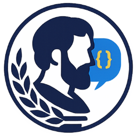

<p align="center">
  
</p>

## 🔗 🤖 Aristotle - The Developer Assistant ֎ 

## PROJECT ABSTRACT

Aristotle is a documentation and codebase grounded agentic developer assistant that delivers precise, up-to-date answers about software libraries and codebases. The project targets a persistent industry pain point: developers lose significant time context-switching between official docs, forums, and scattered examples-especially as frameworks evolve rapidly and teams juggle both public and internal repositories. Aristotle combines retrieval-augmented generation (RAG) with dual sources of truth-documentation pages and the source code itself-to return concise, citation-backed responses such as required function arguments, error fixes, and idiomatic usage patterns (Python first, language-extensible). The system continuously live-updates its index to reflect edits in the user’s working tree and can ingest local projects or any public Git repository, minimizing hallucinations by grounding outputs in verifiable artifacts. Delivered as a VS Code extension, it provides an accessible chat UI and example snippets tailored to the active workspace. While enterprise privacy controls (e.g., air-gapped or firewall deployments) are outside this project’s current scope, the architecture is compatible with such setups for organizations that require private code search. By replacing manual exploration with targeted, evidence-linked retrieval, Aristotle improves developer productivity, shortens time-to-fix, and preserves flow, offering a pragmatic path from “vibe coding” to trustworthy, documentation-backed assistance.


We had an amazing time working on this project, each minute detail is taken care of, you can straight away run this repository to use it for your own private code base as a developer, or use this to learn coding as a student by deploying it as your personal local offline coding tutor, as a VSCode Extension. 

---
## Screenshots of the performance evaluation with responses
Generic Non-Code generating Model: Llama3.1:8B's response for a question:  
<p align="left">
  
</p>
Aristotle agentic framework's Response for the same question, 
when connected with the same generic non-coding model(Llama3.1:8B) which is not pre-trained for code generation.
<p align="left">
  
</p>
Graph Search based result(Bottom), Aristotle's Accurate Response(On the Right)
<p align="left">
  
</p>
Vector Search based result(Bottom), Aristotle's Accurate Response(On the Right)
<p align="left">
  
</p>

---

## CONTRIBUTORS

| Official Full Name (Alphabetical order)  | Student ID  | Work Items | Email |
| :------------ |:---------------:| :-----| :-----|
| Nobert Oliver | A0328685M | Complete design, implementation and code review of all modules| e1553012@u.nus.edu |
| Sharvesh Subhash | A0327428Y | Complete design, implementation and code review of all modules| sharvesh.subhash@u.nus.edu |

---

## VIDEO OF SYSTEM MODELLING & USE CASE DEMO

[](https://youtu.be/-AiYLUjP6o8 "Sudoku AI Solver")

Note: It is not mandatory for every project member to appear in video presentation; Presentation by one project member is acceptable. 
More reference video presentations [here](https://telescopeuser.wordpress.com/2018/03/31/master-of-technology-solution-know-how-video-index-2/ "video presentations")

---

## SECTION 5 :
# Aristotle - Developer Quickstart & VS Code Extension Guide

> Spin up the server, use the VS Code extension, and start contributing — in minutes. If this helps you, **please ⭐ star the repo** and share feedback!

---

## 🚀 Quickstart (TL;DR)

```bash
# Server (Windows + WSL2)
# 1) Install prerequisites: Docker Desktop (with WSL2 integration), Ollama, Neo4j
# 2) Open a terminal in the repo's `system/` folder
cp .env.example .env   # then edit values as needed

docker build -t aristotle:latest .
docker run -p 8000:8000 --add-host=host.docker.internal:host-gateway aristotle:latest

# Visit the API: http://localhost:8000
```

```bash
# UI (VS Code Extension)
# Requires Node v20+ (tip: use nvm), VS Code, and `vsce`
cd ui
npm i
npm i -g vsce
vsce package
# In VS Code: Extensions → … menu → Install from VSIX → pick the generated .vsix
```

Then in VS Code chat: **Ctrl + Shift + I** and type:

```
@aristotle Explain this file
```

---

## 📦 What is Aristotle?

Aristotle is an **agentic Developer assistant** built for Python-centric workflows. It combines **vector search + knowledge graphs** with lightweight LLMs to minimize hallucinations and give accurate, grounded answers from codebases and docs.

* ⚡ Works locally with 8B-class models via **Ollama**
* 🧠 Uses **Neo4j** for graph-enhanced understanding
* 🐳 One-command **Docker** server
* 🧩 **VS Code extension** for in-editor chat and commands

If you like the approach, **please star the repository** - it really helps the project grow!

---

## 🖥️ Server Setup (Windows + WSL2)

### 1) Prerequisites

* **Docker Desktop** for Windows with **WSL2 integration enabled**
* **Ollama** installed and running (verify with `ollama list`)
* **Neo4j** installed, started, and reachable (note your URI, user, password)

### 2) Configure environment

From the repo’s **`system/`** directory:

```bash
cp .env.example .env
```

Open `.env` and fill in the required values. Typical variables include (examples):

```
NEO4J_URI=bolt://localhost:7687
NEO4J_USER=neo4j
NEO4J_PASSWORD=your_password
# Add any model/provider keys/settings your setup requires
```

> Make sure your Neo4j DB is **running** and credentials **match** what you put here.

### 3) Build the image

```bash
docker build -t aristotle:latest .
```

### 4) Run the container

```bash
docker run -p 8000:8000 \
  --add-host=host.docker.internal:host-gateway \
  aristotle:latest
```

* This exposes the API at **[http://localhost:8000](http://localhost:8000)**.
* If your app reads environment variables at runtime and you prefer not to bake them into the image, you can run with:

  ```bash
  docker run -p 8000:8000 --env-file .env \
    --add-host=host.docker.internal:host-gateway \
    aristotle:latest
  ```

### 5) Verify

Open **[http://localhost:8000](http://localhost:8000)**.

* If a health route or docs page is available (e.g., `/health`, `/docs`), check them to confirm everything is wired up.
* Ensure **Ollama** is running locally (default service runs on port **11434**) and that the model(s) you intend to use are available.

---

## 🧩 VS Code Extension (UI)

### Requirements

* **Node.js v20+** (recommended via `nvm install --lts`)
* **VS Code**
* **vsce** packager installed globally: `npm i -g vsce`

### Build & Install

```bash
cd ui
npm i
vsce package   # produces a .vsix
```

Open **VS Code → Extensions** panel → **…** (top-right) → **Install from VSIX…** → select the generated `.vsix` file.

### Use in VS Code

* **Login with GitHub Copilot** (if your workflow requires it)
* Open the **Chat** panel (or press **Ctrl + Shift + I**)
* Start interacting:

  ```
  @aristotle "Explain this function"
  @aristotle "Summarize this module and list its public APIs"
  @aristotle "Suggest tests for this file"
  @aristotle "Use this codebase and tell me how to resolve this using the Pandas library documentations"
  
  ```

---

## 🌟 Why Developers Love Aristotle

* **Grounded answers** from your code & docs (vector + graph retrieval)
* **Low compute, high utility** - runs with 8B models via Ollama
* **Familiar tools** - Docker, Neo4j, VS Code
* **Privacy-first** local workflows

If this resonates, **star the repo** and help more developers discover it!

---

## 🤝 Contributing

We welcome issues, discussions, and pull requests.

**Best way to start:**

1. Star ⭐ the repo and watch for updates
2. Try the quickstart and open issues for any rough edges
3. Look for **good first issue** or ask for one
4. Submit a PR with:

   * Clear scope & checklist
   * Before/After notes or screenshots where relevant

> Tip: If you’re proposing architectural changes (e.g., retriever choice, indexing strategy, model routing), consider opening a short design proposal first so we can collaborate early.

---

## 🛠️ Troubleshooting

**Uvicorn doesn’t start / server exits**

* Check container logs: `docker logs <container>`
* Confirm `.env` values and that **Neo4j** is reachable
* Ensure **Ollama** is running and models are available
* Port 8000 in use? Try `-p 8080:8000` and visit `http://localhost:8080`

**Ollama not reachable from container**

* Make sure Ollama service is running (default **11434**) on the host
* The flag `--add-host=host.docker.internal:host-gateway` lets the container reach the host
* If your app expects a base URL, set it accordingly in `.env`

**Neo4j auth/connection errors**

* Verify `NEO4J_URI`, `NEO4J_USER`, `NEO4J_PASSWORD`
* Ensure the DB is running and accepts Bolt connections (7687 by default)

**`vsce` not found / packaging fails**

* Re-open terminal after `npm i -g vsce`
* Ensure Node v20+ (`node -v`)

---

## 📚 FAQ

**Do I need a GPU?**
No. Aristotle targets small local models; CPU works, GPU is optional for speed.

**Can I use my own models?**
If they run on Ollama (or your adapter), point the config to them.

**Where do I put secrets?**
Use the `.env` file for local dev. For deployments, prefer your platform’s secret store.

---

## 🗺️ Roadmap (high-level)

* Improved graph-based retrieval ops and evaluators
* More language server-style actions in the VS Code UI
* Templates for common project setups and datasets

If you want any of these, please **upvote or comment** on the corresponding issues - or open a PR!

---

## 🙌 Thanks

Every star, issue, and PR helps Aristotle get better. If you shipped something with it, we’d love to hear your story!

## SECTION 6 : PROJECT REPORT / PAPER

`Refer to project report at Github Folder: ProjectReport`

**Recommended Sections for Project Report / Paper:**
- Executive Summary / Paper Abstract
- Sponsor Company Introduction (if applicable)
- Business Problem Background
- Market Research
- Project Objectives & Success Measurements
- Project Solution (To detail domain modelling & system design.)
- Project Implementation (To detail system development & testing approach.)
- Project Performance & Validation (To prove project objectives are met.)
- Project Conclusions: Findings & Recommendation
- Appendix of report: Project Proposal
- Appendix of report: Mapped System Functionalities against knowledge, techniques and skills of modular courses: MR, RS, CGS
- Appendix of report: Installation and User Guide
- Appendix of report: 1-2 pages individual project report per project member, including: Individual reflection of project journey: (1) personal contribution to group project (2) what learnt is most useful for you (3) how you can apply the knowledge and skills in other situations or your workplaces
- Appendix of report: List of Abbreviations (if applicable)
- Appendix of report: References (if applicable)

---
## SECTION 7 : MISCELLANEOUS

`Refer to Github Folder: Miscellaneous`

### HDB_BTO_SURVEY.xlsx
* Results of survey
* Insights derived, which were subsequently used in our system

---

### <<<<<<<<<<<<<<<<<<<< End of Template >>>>>>>>>>>>>>>>>>>>

---

**This [Machine Reasoning (MR)](https://www.iss.nus.edu.sg/executive-education/course/detail/machine-reasoning "Machine Reasoning") course is part of the Analytics and Intelligent Systems and Graduate Certificate in [Intelligent Reasoning Systems (IRS)](https://www.iss.nus.edu.sg/stackable-certificate-programmes/intelligent-systems "Intelligent Reasoning Systems") series offered by [NUS-ISS](https://www.iss.nus.edu.sg "Institute of Systems Science, National University of Singapore").**

**Lecturer: [GU Zhan (Sam)](https://www.iss.nus.edu.sg/about-us/staff/detail/201/GU%20Zhan "GU Zhan (Sam)")**

[](https://www.iss.nus.edu.sg/about-us/staff/detail/201/GU%20Zhan)

**zhan.gu@nus.edu.sg**
